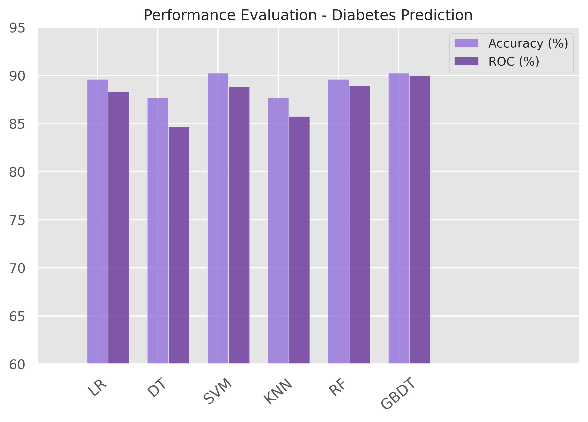
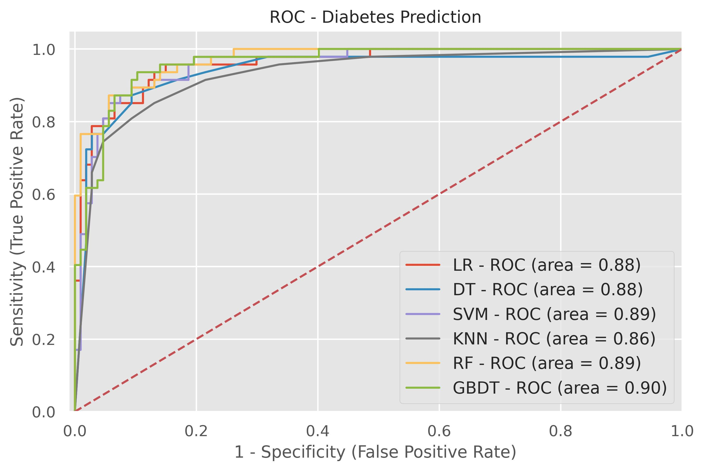

# Diabetes Prediction

This repository contains a project focused on predicting diabetes using various machine learning algorithms. The project includes data preprocessing, exploratory data analysis (EDA), and the implementation of several classification models.

## Table of Contents

- [Introduction](#introduction)
- [Dataset](#dataset)
- [EDA](#eda)
- [Machine Learning Models](#machine-learning-models)
- [Results](#results)

## Introduction

Diabetes is a chronic disease characterized by high levels of sugar in the blood. Early detection and management are crucial to preventing complications. This project aims to build predictive models that can help in identifying individuals at risk of diabetes using various machine learning algorithms.

## Dataset

The dataset used in this project is the Pima Indians Diabetes Database, which is available from the UCI Machine Learning Repository. It consists of several medical predictor variables and one target variable, `Outcome`, indicating whether the patient has diabetes.

- **Pregnancies**: Number of times pregnant
- **Glucose**: Plasma glucose concentration
- **BloodPressure**: Diastolic blood pressure (mm Hg)
- **SkinThickness**: Triceps skinfold thickness (mm)
- **Insulin**: 2-Hour serum insulin (mu U/ml)
- **BMI**: Body mass index (weight in kg/(height in m)^2)
- **DiabetesPedigreeFunction**: Diabetes pedigree function
- **Age**: Age (years)
- **Outcome**: Class variable (0 or 1)

## EDA

Exploratory Data Analysis (EDA) is performed to understand the distribution, central tendency, and spread of the data. Key steps include:

- Reading the dataset
- Descriptive statistics
- Data visualization
- Identifying missing values

## Machine Learning Models

Several machine learning models are implemented and evaluated for predicting diabetes:

1. **Logistic Regression**
2. **K-Nearest Neighbors (KNN)**
3. **Support Vector Machine (SVM)**
4. **Decision Tree**
5. **Random Forest**
6. **Gradient Boosting**

## Results

The performance of each model is evaluated using metrics such as accuracy, precision, recall, and F1-score. A comparative analysis is provided to identify the best-performing model.

